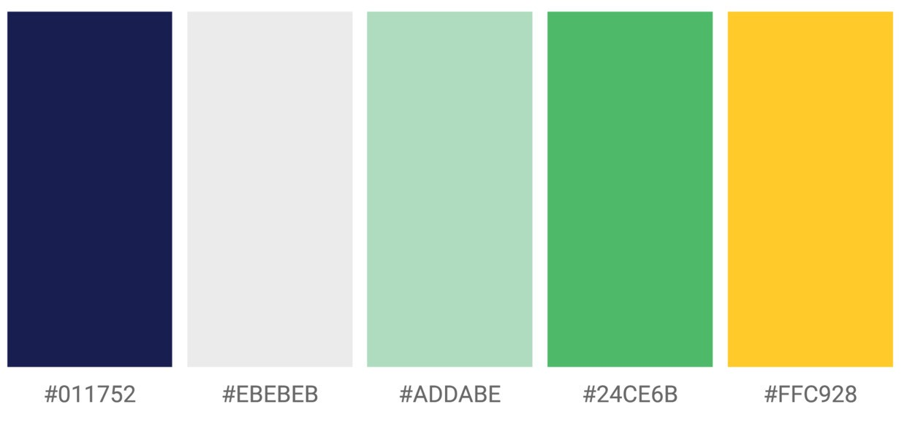
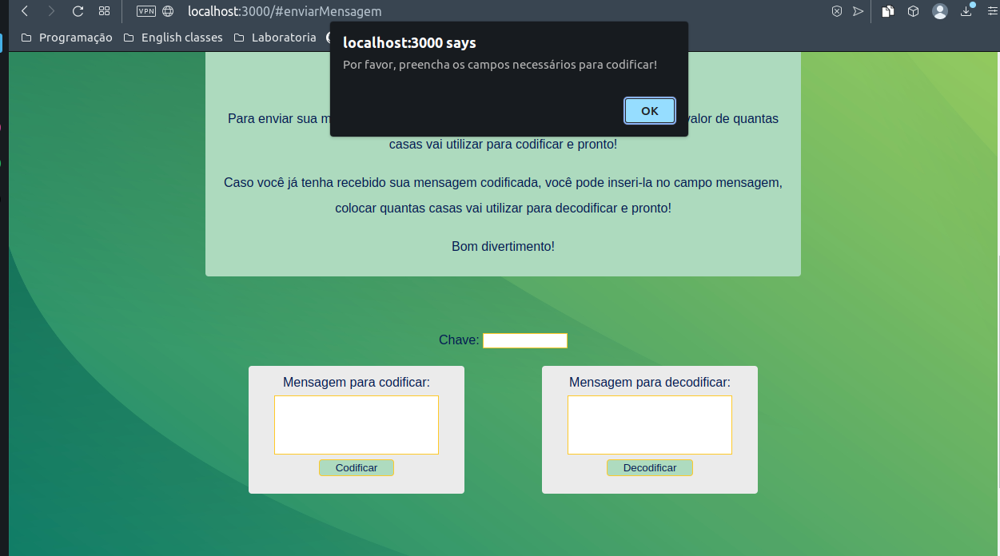

## APRESENTAÇÃO PROJETO CIFRA DE CÉSAR - FALAÍ, BRASA!

## Índice

* [1. Prefácio](#1-prefácio)
* [2. Resumo do projeto](#2-resumo-do-projeto)
* [3. Interface](#3-interface)
* [4. Deploy](#4-deploy)
* [5. Desenvolvedora](#5-desenvolvedora)

## 1. Prefácio 📜

O Cifra de César é o primeiro projeto do bootcampo criado pela Laboratória para a formação de alunas devs Front-End. Este projeto foi desenvolvido de forma individual e teve com objetivo, por meio de um tema livre, a codificação e decodificação de mensagens com deslocamento de letras utilizando os programas HTML, CSS e JavaScript puro. 

## 2. Resumo do projeto 💡

Neste projeto, foram utilizados os programas HTML5, CSS3 e vanilla JavaScript. O tema "Falaí, brasa!" surgiu com o propósito de conectar brasileiros residentes na Ucrânia, por meio de mensagens codificadas, utilizando a cifra de César.

O projeto utilizou a tabela ASCII para fazer o deslocamento de cada letra inserida no campo  de mensagem para codificar. Assim, o usuário pode inserir um número para fazer o devido deslocamento para adiconá-lo em cada caractere na codificação, os cálculos foram inseridos em condicionais de intervalos referente aos caracteres do alfabeto maiúsculos e minúsculos no código ASCII e o resultado final retorna a mensagem codificada.

## 3. Interface ⚙️

O tema escolhido para o projeto foram as cores da bandeira brasileira, pois tinha o objetivo em criar algo mais animado e que remetesse aos brasileiros, seu país de origem. Para que o projeto mantive uma uniformidade, a seguinte paleta de cores foi selecionada:

<figure>

<figcaption>Paleta de cores utilizada como referência</figcaption>
</figure>

A página ainda conta com um menu central para facilitar a navegação do usuário, uma breve explicação do que é a FAIB e como enviar sua mensagem. Há também o espaço ¨chave¨ para que o usuário coloque o número de deslocamento desejado e as caixas para codificar e decodificar. A página também é responsiva quando a janela é aumentada ou diminuída e emite um alerta quando um dos campos não é preenchido corretamente.

<figure>

<figcaption>Erro codificar</figcaption>
</figure>

<figure>

<figcaption>Erro decodificar</figcaption>
</figure>

## 4. Deploy 🖥️

[Projeto Cipher - Falaí, brasa!](https://marinacezario.github.io/SAP009-cipher/)

## 5. Desenvolvedora 👩‍💻

Marina Cezário Guimarães Pereira.
